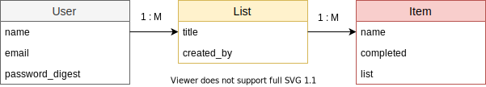

# Todo App - Rails API

This is simple api based service which is used for rails learning. Please check [API Documentation here](https://mohankrish.docs.apiary.io/#)

## Dependencies

```bash
ruby 2.4.7
rails 4.2.11.1
PSQL
Redis
Elastic Search
Sendgrid - used for action mailer
Sidekiq - worker
```

## Model


